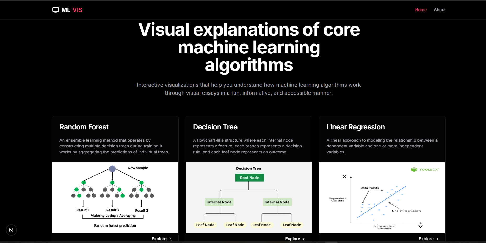
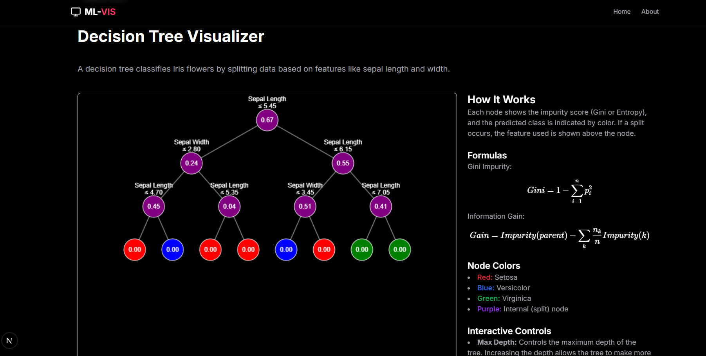

# ML-VIS

> **ML-VIS** is an educational initiative designed to teach machine learning theory and practical applications through **interactive visualizations**.

Our mission is to make complex machine learning concepts accessible to everyone through visual essays that are **fun, informative, and engaging**. Each visualization is crafted to help you intuitively grasp the inner workings of machine learning algorithms — from foundational models to advanced techniques.

---

## 🌐 Live Website

Visit the project here: [https://yourwebsiteurl.com](https://yourwebsiteurl.com)

---

## 🖼️ Website Screenshot 




---

## 📊 Algorithm Visualizations

The following machine learning algorithms and concepts are covered:

-  **Random Forest**
-  **Decision Tree**
-  **Linear Regression**
-  **Logistic Regression**
-  **DB-SCAN**
-  **Support Vector Machines (SVM)**
-  **K-Nearest Neighbors (KNN)**
-  **Self-Organizing Map**
-  **Ada Boost**
-  **Perceptron**

## 🖼️ Example Decision Tree




---

## 🛠️ Installation (for Developers)

```bash
git clone https://github.com/Gowtham0810-hype/ML-VIS.git
cd ML-VIS
npm install
npm start

## 📂 How to Extract the ZIP File

After cloning the repository, you’ll find a large `.zip` file containing key resources or visualizations. You need to extract it to use the contents.

### 🖥️ Windows
Right-click on the file and choose **“Extract All…”**, then follow the prompts.

### 🍎 macOS
Double-click the `.zip` file to automatically extract it.

### 🐧 Linux / macOS Terminal
Open a terminal and run:
```bash
unzip your_large_file.zip

