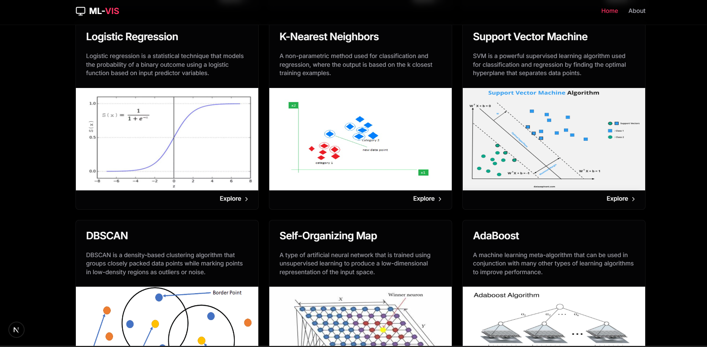

# ML-VIS

> **ML-VIS** is an educational initiative designed to teach machine learning theory and practical applications through **interactive visualizations**.

Our mission is to make complex machine learning concepts accessible to everyone through visual essays that are **fun, informative, and engaging**. Each visualization is crafted to help you intuitively grasp the inner workings of machine learning algorithms — from foundational models to advanced techniques.

---

## 🌐 Live Website

Visit the project here: [https://yourwebsiteurl.com](https://yourwebsiteurl.com)

---

## 🖼️ Website Screenshot 1


## 🖼️ Website Screenshot 2




---

## 📊 Algorithm Visualizations

The following machine learning algorithms and concepts are covered:

-  **Random Forest**
-  **Decision Tree**
-  **Linear Regression**
-  **Logistic Regression**
-  **DB-SCAN**
-  **Support Vector Machines (SVM)**
-  **K-Nearest Neighbors (KNN)**
-  **Self-Organizing Map**
-  **Ada Boost**
-  **Perceptron**


---

## 🛠️ Installation (for Developers)

```bash
git clone https://github.com/Gowtham0810-hype/ML-VIS.git
cd ML-VIS
npm install
npm start
